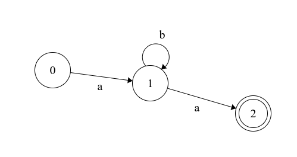

# Automate-header

## Features:
#### Automate
- [x] Create Automata
- [x] Check if a state is final
- [x] Check if message is valid with automata

#### LL
- [x] Create header file
- [ ] Gerer Recursivite a gauche
- [ ] Gerer Factorisation a gauche
- [ ] Nullable method
- [ ] Premier method
- [ ] Suivant method
- [ ] Tableau syntaxique

#### Derivation LL
- [ ] Derivation par depilage
- [ ] Retourner l'arbre syntaxique